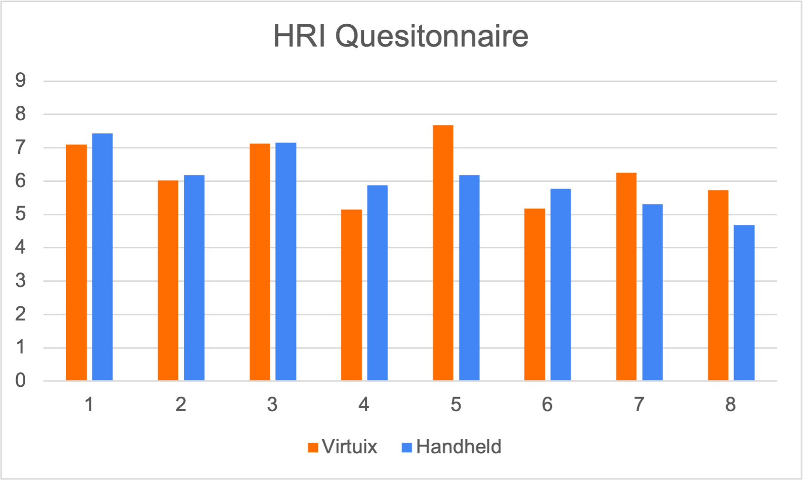
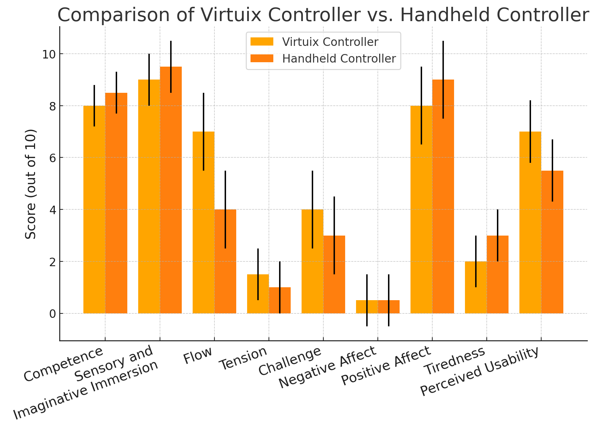
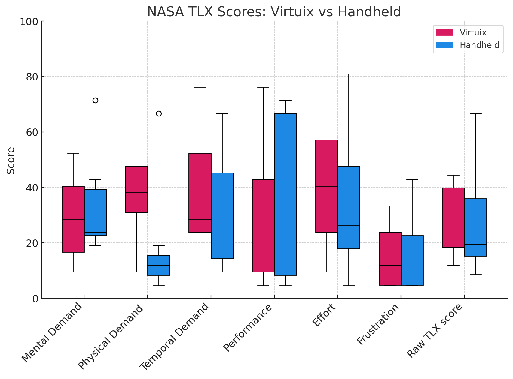
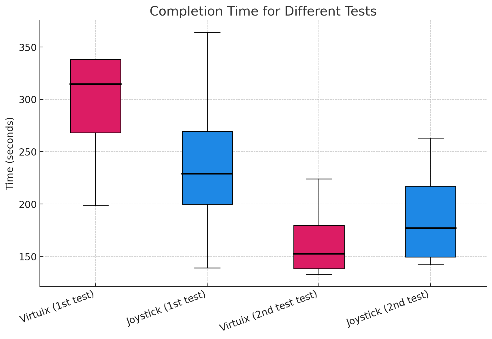

## Test Data
 
### Trust Perception - Human-Robot Interaction (HRI)
The **HRI Questionnaire** was used to assess participants' trust and perception of the two navigation methods: the **Virtuix controller** and the **Handheld controller**. The responses were collected across multiple questions, focusing on user comfort, ease of use, and overall preference.
 
[HRI Questionnaire](https://docs.google.com/forms/d/e/1FAIpQLSd1uSiauXUQvoZFL39ItyxEXuH9e1JHlMNAEKpbMIWclFTjNA/viewform?usp=header)
 

 
The results indicate that participant responses varied between the two systems, with some favoring the **Virtuix controller** for immersion, while others found the **Handheld controller** more intuitive. Further analysis is needed to determine how trust in the system is affected by these factors.
 
### Virtual Reality Immersion (VRI)
The **Virtual Reality Immersion (VRI) questionnaire** measured the perceived level of immersion between the two navigation methods. Participants rated aspects such as **sensory engagement, imaginative immersion, and spatial presence**.
 
[VRI Questionnaire](https://docs.google.com/forms/d/e/1FAIpQLSfe9gvGXbYAm2b8QIOsULymF5n3pbN7eXlDf0UbTbr8_RSDtQ/viewform?usp=header)
 

 
The **Virtuix controller consistently scored higher in immersion-related metrics**, suggesting that the system provides a more engaging virtual experience. However, the **Handheld controller had more stable scores**, indicating a more consistent user experience across participants.
 
### NASA Task Load Index (TLX)
The **NASA TLX** was administered to evaluate the cognitive and physical workload associated with each navigation method. Participants rated dimensions such as **Mental Demand, Physical Demand, Effort, and Frustration**.
 
[NASA TLX Questionnaire](https://docs.google.com/forms/d/e/1FAIpQLScZjLsiitHqwSM1DPXAI6FcpDlAZhxH1dt85ipaS2colu7Xbg/viewform?usp=header)
 

 
The results show **no statistically significant differences (p > 0.05) across most categories**, suggesting that the workload between the two systems is comparable. However, **Effort and Physical Demand scores were slightly higher for the Virtuix controller**, indicating that the system may require more physical exertion.
 
### Task Completion Time
Task completion times were recorded for each participant across different conditions. The **Virtuix controller** and **Handheld controller** were tested in two orders:  
1. **Virtuix first, then Joystick**  
2. **Joystick first, then Virtuix**  
 

 
The results indicate that **completion time decreased** when a system was used for the second time, suggesting **a learning effect**. However, participants who used the **Virtuix controller first had longer completion times** compared to those who started with the **Handheld controller**, indicating a **steeper initial learning curve for the Virtuix system**.
 
---
 
### **Conclusion**
The collected data provides insights into **immersion, workload, trust perception, and performance efficiency** for the two VR navigation methods. While the **Virtuix controller enhances immersion**, it may require **greater physical effort and adaptation time**. The **Handheld controller offers a more consistent experience**, though some users reported higher **motion sickness**. Future research should expand the participant pool and introduce additional cognitive tasks to **further explore the cognitive and physical demands of each system**.